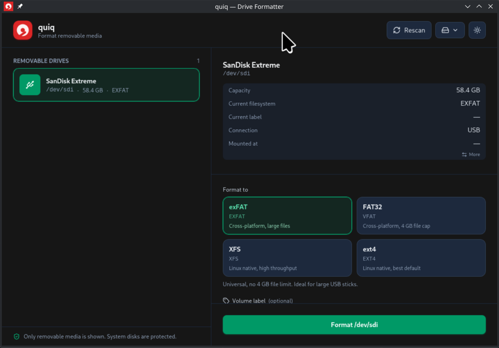

# quiq

quiq is a Linux desktop app for formatting removable media, vibe-coded with love for my beloved wife, queen and mentor. It lists removable drives, lets you choose a filesystem and volume label, and formats the selected device through the system `udisks2` service. It further sets permissions of that new volume to the current $USER.



## Features

- Shows removable drives only; system disks are filtered out.
- Supports common filesystems: ext4, xfs, FAT32, and exFAT.
- Lets you choose a volume label.
- Supports quick format and full erase.
- LUKS2 encryption

## Requirements

- Linux
- Node.js and npm
- Rust 1.77 or newer
- udisks2 on the system

If you build the packaged app, the repository is configured for AppImage and RPM output.

## Development

Install dependencies with your package manager of choice, then run:

```bash
npm run dev
```

This starts the Vite frontend in browser mode. It uses mock drive and filesystem data, so it does not touch real hardware.

To run the full desktop app with Tauri:

```bash
npm run tauri dev
```

## Build and Package

```bash
npm run build
npm run preview
npm run tauri
npm run gen:icons
```

- `npm run build` compiles the frontend and Rust app for release checks.
- `npm run preview` serves the built frontend.
- `npm run tauri` runs the Tauri CLI.
- `npm run gen:icons` regenerates the app icons.

## Usage

1. Start the app.
2. Select a removable drive.
3. Choose a filesystem and optional label.
4. Pick quick format or full erase.
5. Confirm the destructive action in the dialog.

Formatting is delegated to `udisks2`, which handles unmounting and privilege escalation when needed.

## Safety Notes

- Only removable media is shown.
- The app refuses to operate on system disks.
- Full erase is explicit and slower than a metadata-only format.
- Double-check the selected device before confirming a format.

## License

GPL-3.0-or-later
